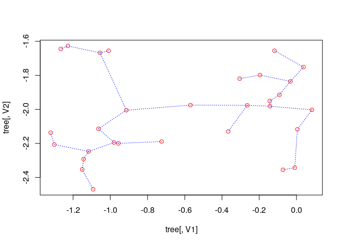
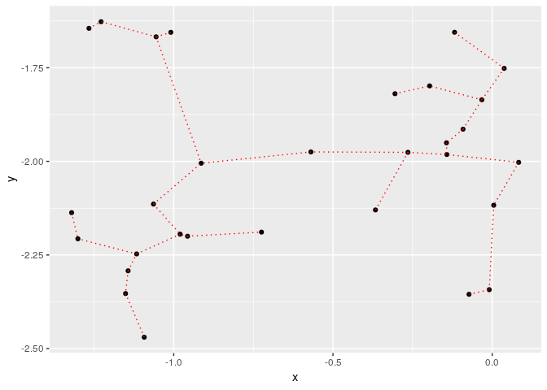

<!-- README.md is generated from README.Rmd. Please edit that file -->
emstreeR
========

<!-- # emstreeR  -->
[](https://travis-ci.org/allanvc/emstreeR) [](https://cran.r-project.org/package=emstreeR) <!-- [](http://www.r-pkg.org/pkg/emstreeR) --> [](https://cran.r-project.org/package=emstreeR) [](https://opensource.org/licenses/BSD-3-Clause)

Overview
--------

The **emstreeR** package allows users to fast and easily compute an Euclidean Minimum Spanning Tree from data. This package uses 'mlpack' - the C++ Machine Learning library which is called on background. **emstreeR** works as a wrapper, so that R users can benefit from the C++ function for computing an Euclidean Minimum Spanning Tree without touching the C++ code. The package also provides functions and an S3 method for readily plotting the Minimum Spanning Trees (MST) using either 'base' R, 'scatterplot3d' or 'ggplot2' style.

-   `computeMST()` computes an Euclidean Minimum Spanning Tree (EMST) for the input data.
-   `plot.MST()` an S3 method of the generic function plot() for plotting a 2D MST.
-   `plotMST3D()` plots a 3D MST.
-   `stat_MST()` a 'ggplot2' Stat extension for plotting a 2D MST.

Installation
------------

``` r
# CRAN version
install.packages("emstreeR") # not working yet

# Or Github version
if (!require('devtools')) install.packages('devtools')
devtools::install_github("allanvc/emstreeR")
```

Basic Usage
-----------

``` r
## artificial data:
set.seed(1984)
n <- 7
c1 <- data.frame(x = rnorm(n,-0.2, sd=0.2), y = rnorm(n,-2,sd=0.2))
c2 <- data.frame(x = rnorm(n,-1.1, sd=0.15), y = rnorm(n,-2,sd=0.3)) 
d <- rbind(c1, c2)
d <- as.data.frame(d)

## MST:
library(emstreeR)
out <- ComputeMST(d)
#> 8 edges found so far.
#> 182 cumulative base cases.
#> 0 cumulative node combinations scored.
#> 12 edges found so far.
#> 344 cumulative base cases.
#> 0 cumulative node combinations scored.
#> 13 edges found so far.
#> 442 cumulative base cases.
#> 0 cumulative node combinations scored.
#> Total spanning tree length: 8.81192
out
#>               x         y from to  distance
#> 1  -0.118159357 -2.166545   11 13 0.2039000
#> 2  -0.264604994 -2.105242    6  7 0.3429154
#> 3  -0.072829535 -1.716803   10 14 0.3540068
#> 4  -0.569225757 -1.943598    8 12 0.3541008
#> 5  -0.009270527 -1.942413    1  2 0.4825166
#> 6   0.037697969 -1.832590    3  7 0.5072094
#> 7  -0.091509110 -1.795213   12 13 0.6017045
#> 8  -1.097338236 -1.871078    5  6 0.7142135
#> 9  -0.841400898 -2.194585    8 14 0.8351710
#> 10 -1.081888729 -1.728982    4 12 0.9724635
#> 11 -1.366334073 -2.003965    4  5 1.0563892
#> 12 -1.081078171 -1.925745    2  5 1.1558933
#> 13 -1.357063682 -1.972485    2  9 1.2314331
#> 14 -0.913706515 -1.753315    1  1 0.0000000
```

Plotting
--------

### 2D Plots

``` r
## artifical data for 2D plots:
set.seed(1984)
n <- 15
c1 <- data.frame(x = rnorm(n,-0.2, sd=0.2), y = rnorm(n,-2,sd=0.2))
c2 <- data.frame(x = rnorm(n,-1.1, sd=0.15), y = rnorm(n,-2,sd=0.3)) 
d <- rbind(c1, c2)
d <- as.data.frame(d)
  
## MST:
library(emstreeR)
out <- ComputeMST(d, verbose = FALSE)
```

``` r
## simple 2D plot:
plot(out, col.pts = "red", col.segts = "blue")
```



``` r
## 2D plot with ggplot2:
library(ggplot2)
ggplot(data = out, aes(x = x, y = y, from = from, to = to))+ 
  geom_point()+ 
  stat_MST(colour="red")
```



``` r
## 2D curved edges plot with ggplot2:
library(ggplot2)
ggplot(data = out, aes(x = x, y = y, from=from, to=to))+ 
  geom_point()+ 
  stat_MST(geom="curve")
```


### 3D Plot

``` r
## artificial data for 3D plots:
n = 99
set.seed(1984)
d1<-matrix(rnorm(n,mean=-2,sd=.5), n/3, 3) # 3d
d2<-matrix(rnorm(n,mean=0,sd=.3), n/3, 3)
d3<-matrix(rnorm(n,mean=3,sd=.4), n/3, 3)
d<-rbind(d1,d2,d3) # just to show a matrix input
  
## MST:
library(emstreeR)
out <- ComputeMST(d, verbose = FALSE)
```

``` r
## simple 3D plot:
plotMST3D(out, xlab = "xaxis", main="Just a MST 3D plot")
```


Extras
------

``` r
## plotting MST on maps:
# honeymoon cruise example

library(ggmap)
library(dplyr)  
    
## define ports:
df.port_locations <- data.frame(location = c("Civitavecchia, Italy", 
                                             "Genova, Italy",
                                             "Marseille, France",
                                             "Barcelona, Spain",
                                             "Tunis, Tunisia",
                                             "Palermo, Italy"), 
                                stringsAsFactors = FALSE)
    
## get latitude and longitude:
geo.port_locations <- geocode(df.port_locations$location, source = "dsk")
    
## combine data:
df.port_locations <- cbind(df.port_locations, geo.port_locations)
    
## MST:
library(emstreeR)
out <- ComputeMST(df.port_locations[,2:3], verbose = FALSE)
```

``` r
## Plot:
map_grid <- c(left = -8, bottom = 32, right = 20, top = 47)
    
get_stamenmap(map_grid, zoom = 5) %>% ggmap()+
  stat_MST(data = out,
           aes(x = lon, y = lat, from=from, to=to), 
           colour="red", linetype = 2)+
  geom_point(data = out, aes(x = lon, y = lat), size=3)
```


License
-------

This package is licensed under the terms of the BSD 3-clause License.
